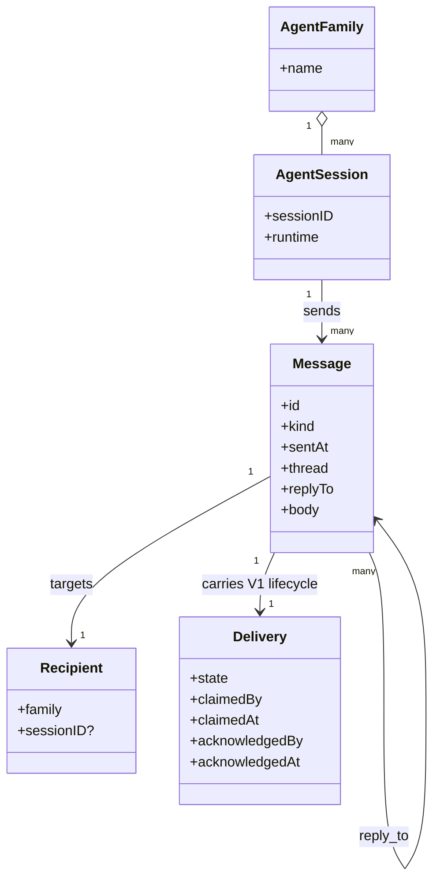
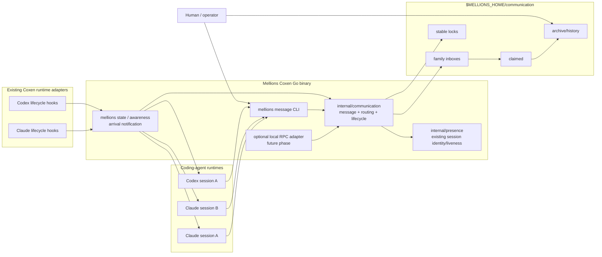
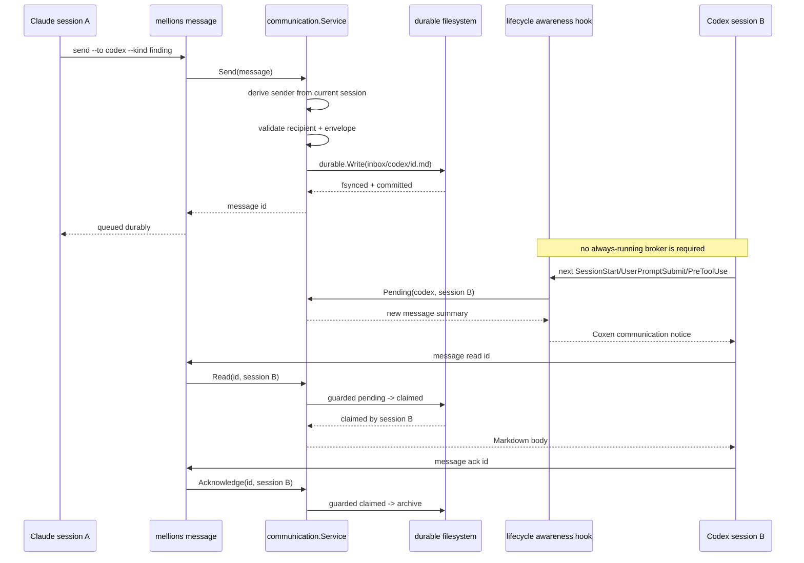
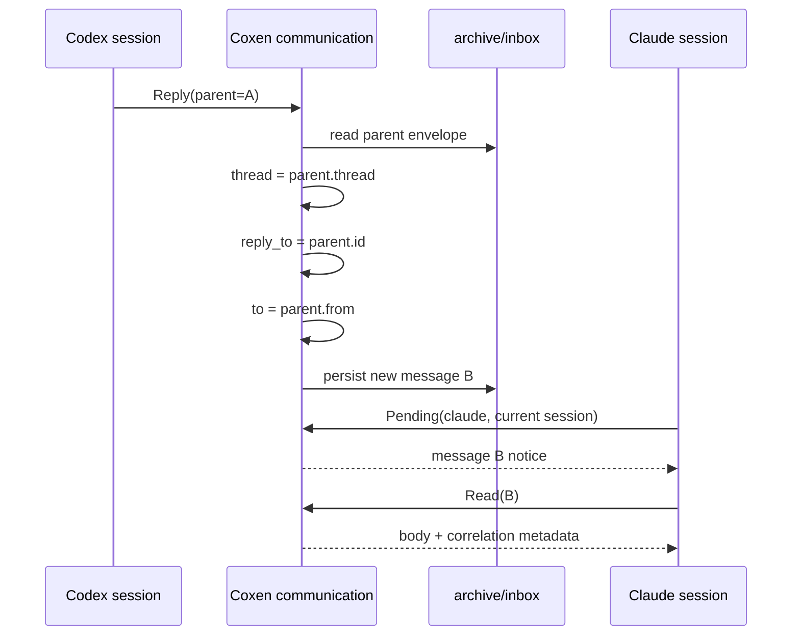
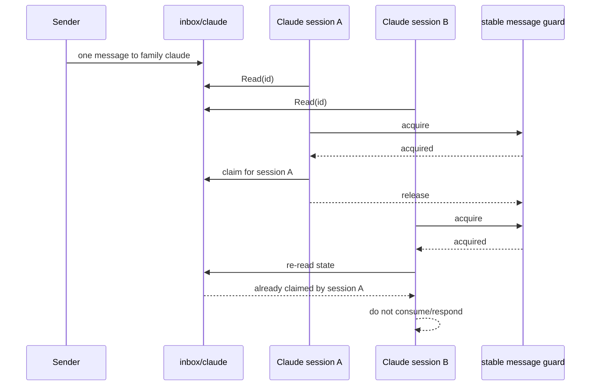
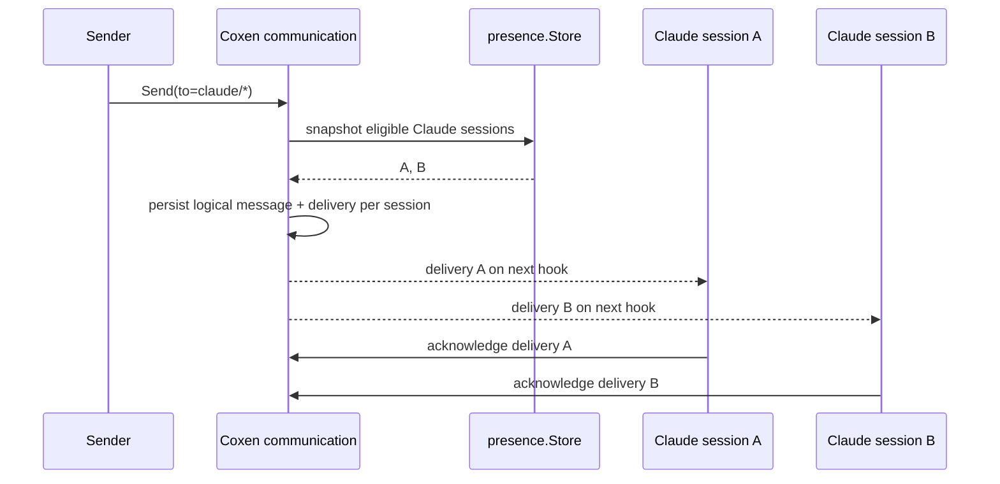

<!-- Mellions Coxen | LetA Tech Ltd. | leta@letatech.ca -->

# Durable agent communication

> **Status:** proposed architecture and implementation specification. This document does not describe an implemented feature yet.
>
> **Governing principle:** build durable agent communication with optional RPC access, not agent-to-agent RPC with hidden transient state. The filesystem record is authoritative. Hooks and RPC are delivery/access mechanisms over it.

## Purpose

Independent coding-agent sessions sometimes establish facts, dependencies, risks, review findings, or work state that another session needs to know. Mellions Coxen already knows which sessions are working where and already delivers situational awareness through runtime lifecycle hooks, but it does not currently own a durable, runtime-neutral communication primitive.

This feature fills that gap without turning Coxen into a message broker or agent orchestrator.

```text
Agent A
   |
   | send
   v
Coxen communication
   |
   +-- persist durable message
   +-- route to logical recipient inbox
   +-- surface arrival through runtime hooks
   v
Agent B

        +

Human
   |
   v
plain-text communication history
```

The communication record is a first-class product outcome, not logging added after the fact. A human should be able to establish what one agent told another, when, why, what work it referred to, who consumed it, and what response followed without reconstructing invisible RPC traffic or comparing separate vendor transcripts.

---

# 1. Current Coxen architecture this design must preserve

This specification is derived from the current repository rather than from a generic agent-messaging design.

Existing Coxen primitives already solve much of the hard local coordination work:

- `internal/presence` records runtime, session ID, process identity, working tree, repository, branch, assignment, start time, and last-seen time for coding-agent sessions.
- `presence.Here()` already recognizes the `claude` and `codex` runtime/session environments.
- `cmd/mellions/state.go` already runs in lifecycle delivery, refreshes session presence, derives situational awareness, and remembers what a session was already told.
- `hooks/awareness.sh` and `hooks/awareness-tool.sh` already surface new information at the next prompt and at a later tool call during a long autonomous turn.
- `hooks/session-work.sh` already registers a session and delivers work/peer context at session start.
- `internal/awareness.Said` already holds the useful invariant that unsolicited information is said once per session, on disk, rather than repeated until it becomes noise.
- `internal/durable.Write` already performs unique-temp staging, file `fsync`, atomic rename, and parent-directory `fsync`.
- `internal/durable.Guard` already provides a cross-process Unix `flock` and deliberately refuses unguarded mutation where that guarantee is unavailable.
- `cmd/mellions` is already the small deterministic surface usable from plugins, terminals, timers, CI, Claude Code, and Codex.
- Mellions host state already lives outside target repositories through `reportRoot()` / `home()`.
- `go.mod` currently carries no third-party module dependencies.

The current architecture also says coding-agent runtimes own their native sessions and native cross-session messaging. That remains correct. Coxen communication must **not** replace Claude Code teams/subagents/native messaging, Codex-native coordination, runtime permissions, or vendor-specific capabilities.

The new primitive has a narrower purpose:

> **durable, runtime-neutral communication across independent Coxen-integrated sessions, especially across runtime families, with human-visible provenance.**

Native runtime messaging remains useful for transient same-runtime collaboration. Only communication deliberately sent through Coxen becomes part of this durable record.

After implementation is verified, `docs/architecture.md`, `docs/integrations.md`, `docs/data-handling.md`, and `docs/cli.md` should be updated to describe the implemented surface. They should not claim it before it exists.

---

# 2. Goals and non-goals

## Goals

V1 must provide:

1. durable local message creation;
2. family-targeted delivery, initially `claude` and `codex`;
3. session identity underneath a family inbox;
4. safe concurrent claiming so multiple sessions do not independently take one family message;
5. explicit acknowledgement;
6. durable reply/thread correlation;
7. assignment/issue references without turning tasks into inbox owners;
8. lifecycle-hook awareness when communication is waiting;
9. offline durability;
10. plain-text, human-inspectable history;
11. a small CLI surface;
12. no database;
13. no always-running service for the first usable version;
14. an optional tiny local RPC transport later, using the exact same communication core and filesystem truth.

## Non-goals for V1

V1 must not attempt to provide:

- distributed consensus;
- cross-host delivery;
- a remote message broker;
- Kafka, NATS, Redis, RabbitMQ, SSE, WebSocket infrastructure, or a hosted coordination service;
- exactly-once processing claims;
- a second runtime authorization system;
- automatic execution of instructions found in messages;
- model-to-model token streaming;
- hidden transient RPC state as source of truth;
- one inbox directory per running session;
- task-owned inbox trees;
- automatic broadcast fan-out to every running session;
- automatic ranking/prioritization of messages;
- automatic deletion of unread messages;
- arbitrary machine-control messages that can bypass runtime permissions.

These omissions are deliberate. V1 is not an unfinished enterprise message broker.

---

# 3. Core architectural decisions

## 3.1 Communication state belongs under Mellions host state

Do **not** create `.coxen/communication` inside every target repository.

Coxen already keeps cross-session operational state outside target repositories. Communication should use the same boundary because it can cross repositories, must survive worktree deletion, and should not dirty application repositories.

Default root:

```text
$MELLIONS_HOME/communication/
```

Resolve it through the existing `Config.home()` rule. If `MELLIONS_HOME` is unset, it naturally follows the current report-root behavior.

No shell hook, CLI subcommand, or RPC adapter should invent a second default. They ask the Go configuration layer for the communication root.

## 3.2 Physical inbox ownership is per `AgentFamily`

A physical inbox per session creates topology proportional to session count. A task-owned inbox confuses work identity with recipient identity. One global inbox creates unnecessary filtering and claim ambiguity.

V1 therefore uses:

```text
AgentFamily -> one physical inbox
AgentSession -> logical consumer identity within that family
```

With ten Claude sessions and five Codex sessions, the physical shape remains:

```text
inbox/
  claude/
  codex/
```

not fifteen inbox directories.

## 3.3 `AgentFamily` maps to the existing runtime identity

Coxen already uses runtime identifiers such as `claude` and `codex` in `presence.Session.Runtime`. Do not create a competing family registry with different names.

Initial values:

```text
claude
codex
```

Conceptually, `AgentFamily` is the communication/routing term and `Runtime` is the integration term. Their identifiers are intentionally the same.

An agent family is **not** a model family. A Claude Code runtime selecting a different model remains `claude` for Coxen routing.

## 3.4 Family delivery is single-consumer by default

A family-targeted message means:

> one eligible session in that family should take responsibility for this message.

It does **not** mean every session should independently respond.

V1 address forms:

```text
claude                 # family queue: one Claude session claims
codex                  # family queue: one Codex session claims
```

Direct-session forms are designed but enabled only after runtime identity behavior is verified:

```text
claude/<session-id>
codex/<session-id>
```

Reserve for a later fan-out phase:

```text
claude/*
codex/*
*
```

Using bare `claude` / `codex` for “one suitable session” keeps `*` unambiguously available for “all.”

## 3.5 Task, issue, repository, and thread are context, not inbox owners

A message may refer to an assignment, issue, pull request, repository, or work-register row. Those references explain **what the communication concerns**. They do not decide who owns an inbox.

Do not create:

```text
inbox/task/...
inbox/issue/...
inbox/repository/...
```

Family/session routing is enough for V1. Repository- or assignment-aware routing can be evaluated later if actual usage proves family routing too broad.

## 3.6 No outbox copy in V1

A separate sender outbox duplicates messages already retained in active/archive history and introduces synchronization problems.

Sent history is derived from message metadata (`from`) across the communication store. Therefore V1 needs no copied outbox file.

## 3.7 No database

V1 scale is small, local, append/transition oriented, and already fits Coxen's durable file-backed architecture. A database would add schema, migration, backup, recovery, packaging, and locking concerns without solving a demonstrated problem.

The filesystem remains authoritative.

---

# 4. Communication ontology

Keep the ontology intentionally small.

## `AgentFamily`

A supported coding-agent runtime family used for routing.

Initial values: `claude`, `codex`.

## `AgentSession`

One independent runtime session inside an `AgentFamily`.

Reuse existing `presence.Session`. Communication stores references to `{family, session_id}` but does **not** duplicate PID, repository, branch, assignment, or liveness state.

## `Sender`

The endpoint that authored a message:

```text
AgentFamily + AgentSession
```

Derive sender identity from current runtime/hook context where possible. Do not trust a user-supplied filesystem path as identity.

## `Recipient`

One of:

1. **family recipient** — e.g. `codex`; one eligible Codex session may claim;
2. **session recipient** — e.g. `codex/<session-id>`; only that session may claim, after this mode is runtime-verified.

Broadcast is reserved for later.

## `Message`

The durable communication artifact: a small machine-readable envelope plus Markdown body.

A V1 message has one logical delivery. This simplification lets one file carry both content and lifecycle without a separate delivery database.

## `Thread`

A stable identifier grouping related messages.

Rules:

- if a new message has no supplied thread, set `thread = message.id`;
- a reply inherits the parent's thread;
- thread is sufficient conversation correlation;
- do not add a separate `CorrelationID` in V1 because `id + thread + reply_to` already answer the needed questions.

## `Reply`

A normal `Message` whose `reply_to` references another message ID. Reply is a relationship, not a separate payload type.

## `AssignmentReference`

Optional Coxen assignment ID naming work the message concerns. It does not transfer assignment ownership by itself.

## `IssueReference`

Optional tracker/work-register reference naming external work. It does not mutate or close that work.

## `Delivery`

The lifecycle of the one V1 recipient:

```text
pending -> claimed -> acknowledged
```

## `Claim`

A session has taken the message as the active consumer. Claiming prevents another session in the family from independently taking the same message under normal local concurrency.

A claim does not mean the engineering work described in the message is complete.

## `Acknowledgement`

The claiming session explicitly records that the communication has been handled/incorporated enough to leave the active inbox. Acknowledgement moves it into durable archive/history.

## `Consumed`

Do not persist a separate `consumed` boolean. `claimed` answers who took it and when; `acknowledged` answers whether delivery was completed.

## `Archive`

Acknowledged communication retained for history. Archive is not deletion.

## `Priority` and `TTL`

Intentionally omitted from V1.

Coxen should not invent a priority scheme because messaging products often have one. Likewise, an implicit TTL conflicts with durable provenance by silently destroying unread communication.

Add either only when operational evidence justifies clear semantics.

### Relationship model



---

# 5. Message taxonomy

V1 uses a small human-communication taxonomy:

| Kind | Meaning |
|---|---|
| `note` | General context that does not need stronger semantics. Default. |
| `finding` | A fact, observation, evidence, or conclusion another agent needs. |
| `request` | A request to investigate, verify, review, implement, or perform another action. |
| `question` | A question whose response should normally correlate through `reply_to`. |
| `handoff` | Context/responsibility deliberately passed to another agent/family. |
| `dependency` | A dependency or changed assumption affecting another agent's work or the sender's ability to continue. |

Do not add `answer`; an answer is a reply to a question. Do not add `review-request`; it is a `request`. `warning`, `status`, and `implementation-note` can remain `finding` or `note` until code genuinely needs to distinguish them.

## Human communication versus machine control

V1 messages are **communication**, not executable control records.

A message can say:

> Review commit X before continuing.

But the message cannot authorize a merge, alter runtime permissions, execute a shell command, grant credentials, or bypass an owner-reserved decision.

The recipient's engineering judgment and native runtime controls decide what follows.

If Coxen later needs machine-actionable control records, design a separate explicit schema/command surface rather than smuggling authority into Markdown message kinds.

---

# 6. Message format

## Decision: Markdown body + stdlib-parseable JSON envelope marker

Do not introduce YAML parsing solely for communication frontmatter.

The Go module currently has no third-party dependencies, and Coxen already uses JSON embedded inside an HTML comment for machine-readable claim metadata. Reuse that pattern.

Example:

```markdown
<!-- mellions:message {"version":1,"id":"msg-20260909T184717.381492Z-7a32c8df2a47e109","from":"claude/8af2d9","to":"codex","sent_at":"2026-09-09T18:47:17Z","kind":"finding","thread":"msg-20260909T184717.381492Z-7a32c8df2a47e109","assignment":"IMP-024","issue":"LetA-Tech/mcfo-finsor#1088","delivery":{"state":"pending"}} -->

# LeanKit runtime contract changed

The current LeanKit remediation changed the composition contract used by Finsor.

Before continuing the Finsor production-readiness remediation, review commit
`abc123` and verify the assumptions around ...
```

A reply:

```markdown
<!-- mellions:message {"version":1,"id":"msg-20260909T185203.100911Z-5a3e91d249b25531","from":"codex/91cd22","to":"claude/8af2d9","sent_at":"2026-09-09T18:52:03Z","kind":"finding","thread":"msg-20260909T184717.381492Z-7a32c8df2a47e109","reply_to":"msg-20260909T184717.381492Z-7a32c8df2a47e109","assignment":"IMP-024","issue":"LetA-Tech/mcfo-finsor#1088","delivery":{"state":"pending"}} -->

# Reviewed

I traced the changed contract through Finsor. Two assumptions survive and one does not...
```

### Why this representation

- body is ordinary Markdown and naturally carries prose, code, diffs, links, and evidence;
- humans can inspect raw files directly;
- agents already handle Markdown well;
- metadata parser uses `encoding/json` from Go stdlib;
- the marker is explicit and versioned;
- no bespoke YAML-subset parser is needed;
- no JSON sidecar is needed for one-recipient V1;
- the same file can carry content and lifecycle;
- an intentionally exported thread can be preserved by Git if a human chooses, while the live mailbox itself remains local.

The Markdown body after the marker must remain byte-for-byte stable across delivery-state rewrites.

## Envelope

Conceptual Go shape:

```go
type Envelope struct {
    Version    int       `json:"version"`
    ID         string    `json:"id"`
    From       string    `json:"from"`
    To         string    `json:"to"`
    SentAt     time.Time `json:"sent_at"`
    Kind       Kind      `json:"kind"`
    Thread     string    `json:"thread"`
    ReplyTo    string    `json:"reply_to,omitempty"`
    Assignment string    `json:"assignment,omitempty"`
    Issue      string    `json:"issue,omitempty"`
    Delivery   Delivery  `json:"delivery"`
}

type Delivery struct {
    State          State      `json:"state"`
    ClaimedBy      string     `json:"claimed_by,omitempty"`
    ClaimedAt      *time.Time `json:"claimed_at,omitempty"`
    AcknowledgedBy string     `json:"acknowledged_by,omitempty"`
    AcknowledgedAt *time.Time `json:"acknowledged_at,omitempty"`
}
```

V1 states:

```text
pending
claimed
acknowledged
```

Unknown schema versions, kinds, states, or malformed required fields are rejected/quarantined rather than guessed.

## IDs

Do not add a UUID/ULID dependency for V1.

Generate a filename-safe, time-sortable ID from UTC time plus cryptographic random bytes, for example:

```text
msg-20260909T184717.381492Z-7a32c8df2a47e109
```

Use `crypto/rand` for the random suffix and collision-check before commit. Time aids human ordering; entropy provides uniqueness.

Filename:

```text
<message-id>.md
```

Never derive filesystem paths from `from`, `to`, title, assignment, issue, or body content.

---

# 7. Filesystem design

## V1 layout

```text
$MELLIONS_HOME/
  communication/
    inbox/
      claude/
      codex/
    claimed/
      claude/
      codex/
    archive/
      claude/
      codex/
    quarantine/
    locks/
```

There is intentionally:

- no per-session inbox directory;
- no task inbox;
- no database;
- no outbox copy;
- no RPC-owned state directory.

Each message exists in exactly one active/history location in V1.

## State by location

```text
inbox/<family>/<id>.md      delivery.state = pending
claimed/<family>/<id>.md    delivery.state = claimed
archive/<family>/<id>.md    delivery.state = acknowledged
```

The envelope state is authoritative if a crash leaves path and state temporarily inconsistent. `Reconcile` repairs location from envelope state on the next communication operation or explicit `doctor` pass.

`quarantine/` contains malformed files Coxen cannot safely interpret. A bad message must not block the rest of an inbox.

`locks/` provides a stable lock base per message ID so locking does not move with lifecycle state:

```text
$MELLIONS_HOME/communication/locks/<message-id>
```

Use existing `durable.Guard` against that stable base.

## Atomic creation

`Send`:

1. validate sender, recipient, kind, references, body size, and UTF-8/body policy;
2. generate ID;
3. derive recipient family from parsed address;
4. ensure root/family directory exists with private permissions;
5. serialize complete pending message;
6. commit directly to `inbox/<family>/<id>.md` with `durable.Write`;
7. report success only after the durable write succeeds.

Because V1 has one logical recipient, message + delivery can be one atomic file commit. Do not add a separate receipt transaction yet.

## Read / claim transition

For `Read(id, currentSession)`:

1. acquire `durable.Guard(locks/<id>)`;
2. locate message in active directories;
3. parse and validate;
4. verify current session is eligible for `to`;
5. if already claimed by the same session, allow idempotent re-read;
6. if claimed by another session, do not deliver it;
7. if pending, write the body to the caller while the guard is held;
8. only after output succeeds, set `state=claimed`, `claimed_by`, `claimed_at` and durably rewrite;
9. move to `claimed/<family>/<id>.md` and durably sync affected directories.

The output-before-state rule intentionally favors **at-least-once presentation** after a crash. If the process dies after the body reaches the caller but before claim commit, the message may be shown again. A duplicate is preferable to a message marked consumed that never reached the agent.

Add one small durable move/rename helper instead of duplicating `rename + directory fsync` logic in communication. It must sync both source and destination directories when they differ.

If state rewrite succeeds but move fails, `Reconcile` sees `state=claimed` and moves the file to the correct location. Content is not lost.

## Acknowledgement

For `Acknowledge(id, currentSession)`:

1. guard stable message lock;
2. locate/parse claimed message;
3. verify claimant identity;
4. if already acknowledged, succeed idempotently;
5. set `state=acknowledged`, `acknowledged_by`, `acknowledged_at`;
6. durably rewrite;
7. durably move to `archive/<family>/<id>.md`.

A crash between rewrite and move is repaired from envelope state.

## Reply

`Reply(parentID, body, kind)` is convenience over `Send`:

- read parent envelope;
- set `reply_to = parent.id`;
- inherit `thread = parent.thread`;
- default recipient to parent's sender endpoint;
- copy assignment/issue references unless explicitly overridden;
- send a new independent message.

The parent is never mutated to attach replies.

## Duplicate prevention

Message IDs are Coxen-generated. `Send` refuses to overwrite an ID found anywhere in inbox/claimed/archive/quarantine.

Caller idempotency is message-ID based in V1. If future RPC clients need retry-safe caller-generated idempotency keys, add that field when a real client requires it.

## Concurrent access

- creation uses unique IDs and `durable.Write`;
- each lifecycle mutation uses the stable message guard;
- two sessions racing one family message serialize through the same guard;
- the loser re-reads claimed state and does not independently consume;
- a failed lock must fail the claim/ack rather than fall back to unlocked mutation;
- on platforms where current `durable.Guard` refuses, V1 must likewise refuse operations that require the guarantee rather than falsely claim concurrency safety.

## Crashed writers

Existing `durable.Write` staging means readers see a whole old or whole new file rather than a truncated record. Residual `*.tmp` files are ignored and may be cleaned opportunistically; they are never messages.

## Stranded claims

Do **not** invent a short automatic lease for V1.

A claimed message represents responsibility a session took. Automatically returning it to the family after an arbitrary timeout can create duplicate work.

Instead:

- claimed state remains durable across process death;
- the same session may re-read and acknowledge after resume where runtime identity permits;
- `mellions message inbox` and `mellions doctor` identify a claim whose claimant is no longer live as **stranded**;
- `mellions message release <id>` explicitly returns an eligible family-targeted stranded claim to pending;
- direct-session messages require explicit re-address/release if that session will never return.

If real usage later proves safe automatic release is needed, design the lease from evidence rather than guessing a timeout.

## Cleanup / retention

Default:

- pending: never auto-delete;
- claimed: never auto-delete;
- acknowledged archive: retain;
- quarantine: retain for inspection;
- lock files: may be pruned after corresponding messages no longer exist and no process holds them.

A future explicit `mellions message prune` may remove acknowledged history under operator-selected retention. No implicit TTL.

## Git tracking

The live communication root is local host state outside target repositories, therefore raw mailbox history is **not committed to Git by default**.

That is preferable because messages may contain proprietary source context, local paths, session IDs, issue details, and model-bound engineering material.

If a thread becomes durable project doctrine, intentionally export or summarize it into the relevant repository document, issue, assignment record, or pull request. Do not automatically commit raw mailboxes.

If an operator deliberately places `MELLIONS_HOME` inside a Git checkout, `doctor` should warn that communication state could be staged accidentally. `.gitignore` is not a security boundary.

---

# 8. Component architecture



## Boundary rules

1. `internal/communication` owns message/domain semantics and filesystem lifecycle.
2. It may depend on `internal/durable` and session information exposed by `internal/presence`.
3. It must not import Claude- or Codex-specific SDK/provider implementation.
4. Runtime-specific delivery remains in hooks/plugin adapters.
5. RPC imports the communication core; communication never depends on RPC.
6. Filesystem communication remains usable when RPC is absent or broken.
7. Runtime permissions remain outside the communication package.

---

# 9. Sequence flows

## 9.1 Agent sends a family-targeted message



## 9.2 Recipient is offline

```mermaid
sequenceDiagram
    participant C as Claude session
    participant COM as Coxen communication
    participant FS as codex family inbox
    participant X as Codex session (offline)
    participant H as SessionStart hook

    C->>COM: Send(to=codex)
    COM->>FS: persist pending message
    FS-->>COM: durable
    Note over FS,X: recipient is absent; no wake-up is claimed and nothing is lost

    X->>H: later starts/resumes
    H->>COM: Pending(codex, current session)
    COM->>FS: inspect active inbox
    FS-->>COM: pending message
    COM-->>H: arrival summary
    H-->>X: communication exists + message id
    X->>COM: Read + Ack when handled
```

Offline guarantee is persistence, not process resurrection. V1 does not claim to wake a runtime that is not running.

## 9.3 Agent responds



Thread history is reconstructed by `thread`, ordered by `sent_at`, with `reply_to` retaining the local reply relationship.

## 9.4 Many sessions share one family inbox



Ten Claude sessions still share one physical Claude inbox. Claiming decides which session becomes responsible for one family-targeted message.

## 9.5 Broadcast is explicitly deferred

V1 does not implement `claude/*` or `codex/*`.

Correct broadcast requires one logical message with a durable delivery state per recipient. A single `acknowledged` field cannot truthfully represent ten recipients.

If broadcast is later justified:



That phase likely justifies immutable message content plus separate per-recipient delivery records. Do not pay that complexity before broadcast exists.

---

# 10. Hooks and notification

## Core rule

> Durable message arrival and a running model turn are different events.

V1 guarantees persistence and that a relevant running/returning session is informed at the next Coxen lifecycle opportunity. It does not pretend a filesystem write magically wakes an idle/offline model.

## Reuse existing awareness delivery

Do not introduce polling.

Coxen already has lifecycle moments where a session is given relevant state:

- `SessionStart`;
- `UserPromptSubmit` through `hooks/awareness.sh`;
- `PreToolUse` through `hooks/awareness-tool.sh`.

Communication should join those paths.

Recommended behavior:

1. communication exposes a bounded `PendingFor(current family/session)` query;
2. `mellions state` adds compact notes for relevant pending communication;
3. existing per-session `awareness.Said` semantics prevent the same unsolicited arrival note from becoming repeated hook furniture;
4. the note names sender, kind, references/thread summary, and exact command to read;
5. merely notifying a session does **not** claim or acknowledge the message.

Example:

```text
<mellions-state>
Codex session 91cd... sent finding msg-... about assignment IMP-024.
The message is durable and still unclaimed.
  mellions message read msg-...
</mellions-state>
```

## Session start

An offline recipient must learn about pending communication when it returns.

Prefer a small `hooks/session-communication.sh` after `session-work.sh`, unless current implementation proves a bounded message-only mode inside an existing session-start hook is cleaner. A separate hook protects the output budget of existing work/continuity delivery.

It must:

- use `hooks/lib.sh` conventions;
- remain bounded;
- never fail session startup because communication state is unreadable;
- emit only active message summaries, never unbounded archive history;
- not claim/ack merely by showing availability.

## Mid-turn arrival

`awareness-tool.sh` already addresses the case where an autonomous turn may not receive another user prompt for a long time. Communication should be observable through that same `PreToolUse` state path.

A new message written while a session is working can therefore be surfaced at the next relevant tool call without an always-running poller.

## Message creation is the supported arrival event

All supported sends go through `communication.Service.Send` from CLI or later RPC. Coxen therefore knows synchronously when a durable message is created. A separate filesystem watcher is unnecessary for V1 durability.

Direct arbitrary file dropping into `communication/inbox` is not a supported API. Reconciliation can recover Coxen-created files; raw file injection does not bypass validation.

## Immediate wake-up is a later adapter capability

If a runtime later exposes a trustworthy immediate notification/wake mechanism, Coxen may add a best-effort notifier:

```text
persist first -> optional notify second
```

Notification failure never rolls back a durable message. Ordinary lifecycle delivery remains the fallback.

Do not make the communication core depend on a runtime-specific file-change hook that another supported runtime lacks.

## Codex parity must be verified

The repository currently treats Claude Code as the deeper production-used integration and Codex as implemented but with less production mileage and explicit hook trust requirements.

Before declaring direct session delivery or lifecycle timing equivalent, implementation must code-read and test current Codex hook payloads, session identity, and trust behavior.

Family-level persistence does not depend on perfect runtime parity; automatic lifecycle delivery does.

---

# 11. Go package design

The repository has no public `pkg/` API surface for these capabilities and keeps product logic under `internal/`. Follow that convention.

Recommended shape:

```text
internal/communication/
  message.go        domain types, kinds, address parsing, validation
  format.go         marker + JSON envelope + Markdown parser/serializer
  store.go          filesystem layout, send, locate, list, reconcile
  delivery.go       guarded read/claim/ack/release transitions
  thread.go         reply/thread reconstruction
  service.go        orchestration over store + presence identity
  *_test.go

cmd/mellions/message.go

hooks/session-communication.sh
hooks/test-session-communication.sh

# later only
internal/communicationrpc/
  server.go
  server_test.go
```

Do not split files merely to match the list if fewer files produce clearer code.

## Core surface

Avoid an interface explosion. Keep the file implementation concrete unless a boundary actually needs substitution.

Approximate service API:

```go
type Service struct {
    Store    *Store
    Presence PresenceReader
    Now      func() time.Time
}

type SendInput struct {
    To         Recipient
    Kind       Kind
    Thread     string
    ReplyTo    string
    Assignment string
    Issue      string
    Body       []byte
}

func (s *Service) Send(ctx context.Context, sender Endpoint, in SendInput) (Message, error)
func (s *Service) Pending(ctx context.Context, recipient Endpoint) ([]Summary, error)
func (s *Service) Read(ctx context.Context, recipient Endpoint, id string, w io.Writer) (Message, error)
func (s *Service) Acknowledge(ctx context.Context, recipient Endpoint, id string) error
func (s *Service) Reply(ctx context.Context, sender Endpoint, parentID string, in SendInput) (Message, error)
func (s *Service) Release(ctx context.Context, actor Endpoint, id string) error
func (s *Service) Thread(ctx context.Context, id string) ([]Message, error)
```

`PresenceReader` is the likely useful small interface because tests need deterministic session/liveness state and communication must not own session records.

## Dependency direction

```text
runtime hooks/adapters -> communication
communication -> durable + presence
communication -X-> vendor runtime/provider implementation
RPC -> communication
communication -X-> RPC
```

Add an architecture test if necessary to preserve that direction.

## Configuration

Avoid a new config key in V1.

Default root:

```go
filepath.Join(cfg.home(), "communication")
```

A later `communication_root` override should exist only if a real installation demonstrates that communication must live separately from Mellions host state.

---

# 12. CLI design

Use one noun under the existing binary:

```text
mellions message ...
```

Initial surface:

```text
mellions message send -to <recipient> [-kind note|finding|request|question|handoff|dependency]
                     [-thread <id>] [-reply-to <id>]
                     [-assignment <id>] [-issue <ref>]
                     [-file <path>|-]

mellions message inbox
mellions message read <id>
mellions message ack <id>
mellions message reply <id> [-kind <kind>] [-file <path>|-]
mellions message release <id>
mellions message thread <id>
mellions message list [-all] [-from <endpoint>] [-to <recipient>]
```

Behavior:

- `send` derives sender from current session where possible;
- `inbox` shows pending messages eligible for current family/session plus messages claimed by this session;
- `read` claims a pending message and permits same-session idempotent re-read;
- `ack` explicitly acknowledges/archives;
- `reply` derives thread/reply metadata from parent;
- `release` returns a stranded family claim to pending under explicit action;
- `thread` renders human-readable conversation;
- `list` is inspection/history and may scan archive because it is not in a latency-sensitive hook path.

Do not add a large alias surface in the first release.

---

# 13. Delivery semantics and guarantees

## Coxen guarantees

### Durable send acknowledgement

If `Send` returns success, the complete message has been durably committed to the local store according to Coxen durable-write semantics.

### At-least-once presentation around crashes

Coxen prefers duplicate presentation over silent loss. A reader dying after output but before claim commit can cause a message to be presented again.

### At most one active claimant under the local guard

Under a supported interprocess lock, one family-targeted V1 message has at most one active claimant.

This is **not** exactly-once model reasoning or exactly-once engineering work execution.

### Idempotent acknowledgement

Acknowledging an already acknowledged message has no second effect.

### Explicit ownership

A family message remains pending until a session claims it. A hook notification alone never silently consumes it.

## Coxen does not guarantee

- exactly-once model perception;
- exactly-once tool execution resulting from a message;
- delivery to a session/process that never starts again;
- cross-host delivery;
- fairness among many sessions racing for family work;
- total ordering across unrelated senders;
- cryptographic authenticity against another process running as the same OS user;
- immediate wake-up of an idle agent runtime.

The honest V1 model is:

> **durable write + guarded/idempotent consumption + explicit acknowledgement.**

---

# 14. Failure modes and recovery

| Failure | Required behavior |
|---|---|
| Sender crashes before durable write completes | `Send` does not report success; no partial file is a valid message. |
| Sender crashes after durable write | Message remains pending and deliverable. |
| Recipient offline | Pending message remains until an eligible session returns. |
| Two sessions read simultaneously | Stable per-message guard serializes; one claims, the other re-reads and skips/refuses. |
| Reader crashes after body output but before claim commit | Message can be presented again; intentional at-least-once behavior. |
| Reader crashes after claim | Claim remains durable; same session may resume; dead claimant is reported as stranded. |
| Claimant never returns | Explicit `release`/re-address; no guessed automatic lease. |
| Claim rewrite succeeds but move fails | Envelope says claimed; reconcile moves it into `claimed`. |
| Ack rewrite succeeds but archive move fails | Envelope says acknowledged; reconcile moves it into archive. |
| Partial temp file | Ignored; never treated as a message. |
| Malformed message | Never inject into model context; quarantine and report. |
| Unknown recipient family | Reject before durable write. |
| Direct target unavailable | Never silently fall back to family. Pending/re-address policy remains explicit. |
| Coxen process restarts | State is on disk; next operation reconciles. |
| RPC unavailable | CLI/hooks continue over same filesystem service. |
| Duplicate hook notification | Harmless; per-session awareness memory suppresses ordinary repeats; claim remains idempotent. |
| Non-Unix lock unavailable | Refuse claim/ack operations requiring cross-process safety rather than run unlocked. |

## `Reconcile`

Keep reconciliation bounded to active communication directories, not the entire archive on every hook.

It should:

- ignore/remove stale temp files safely;
- parse active inbox/claimed files;
- move a file whose envelope state disagrees with its directory to the state named by the envelope;
- quarantine malformed files;
- never infer acknowledgement from absence;
- never delete content merely because it is old.

Run it when communication service initializes where cheap and through `mellions doctor` for explicit diagnosis.

---

# 15. Security and trust boundary

This is local developer tooling. Keep security proportional but explicit.

## Filesystem permissions

Recommended defaults:

```text
directories:   0700
message files: 0600
socket/locks:  owner-only where platform permits
```

Agent communication can contain proprietary engineering context, so use private modes rather than the more permissive modes appropriate to some public/local records.

## Local-user trust

V1 does not provide cryptographic sender authentication.

A process running as the same OS user and able to modify `$MELLIONS_HOME` can tamper with communication state. That is consistent with the local-tooling trust boundary. Filesystem permissions, OS controls, and runtime sandboxing are the relevant protections.

Do not claim `from` is tamper-proof against the account owner.

## Path traversal

- Coxen generates message IDs;
- recipient family is parsed against supported values;
- session IDs remain metadata and are not directory names in V1;
- assignment/issue/body never become a path;
- joins remain underneath resolved communication root;
- reject NUL/CR/LF in structured single-line fields and unreasonable lengths.

## Payload limits

Messages are coordination, not artifact storage.

Recommended initial limits:

```text
Markdown body:    256 KiB
JSON envelope:     16 KiB
single ID/ref:      4 KiB maximum, tighter where practical
```

Large logs, binaries, datasets, and reports should be referenced by path, commit, issue, or durable artifact rather than copied into mailbox messages.

## Secrets policy

Messages are not a secret store.

Anything surfaced through a hook may enter the coding-agent transcript and therefore the configured model-provider path.

Rules:

- never intentionally put tokens, private keys, passwords, `.env` contents, production credentials, or customer secrets in messages;
- prefer safe references and minimal evidence excerpts;
- do not claim the existing credential-read guard is a general DLP scanner;
- CLI/help/docs should state that “local file” does not mean “never sent to the model provider.”

## Authorization

Receiving a message grants no authority. It cannot override:

- runtime permissions;
- owner/partnership delegation;
- branch protection;
- repository permissions;
- credential boundaries;
- sandbox/network policy;
- deterministic Coxen safeguards.

Treat the Markdown body as engineering context to evaluate, not executable trusted input.

---

# 16. Human observability

No dashboard is necessary.

Humans should be able to use:

```text
mellions message inbox
mellions message list -all
mellions message thread <id>
mellions message read <id>
```

or inspect the Markdown files directly.

| Question | Source |
|---|---|
| Who sent this? | `from` |
| Who was it for? | `to` |
| When? | `sent_at` |
| What type? | `kind` |
| What task/issue? | `assignment`, `issue` |
| What conversation? | `thread` |
| Was it a reply? | `reply_to` |
| Is it waiting? | inbox + `pending` |
| Who took it? | `claimed_by`, `claimed_at` |
| Was it acknowledged? | archive + acknowledgement fields |
| What response followed? | messages sharing thread/reply correlation |

This plain history is the observability surface. Do not require telemetry, tracing infrastructure, or a database to reconstruct agent collaboration.

---

# 17. Optional tiny local RPC

RPC is an **access mechanism to the same communication service**, not a second state model.

Invariant:

```text
RPC request
    |
    v
communication.Service
    |
    v
same durable filesystem truth
```

Never:

```text
RPC state <-> filesystem state
```

## Transport decision

When RPC is implemented, prefer:

> **HTTP/JSON over a Unix domain socket using Go stdlib.**

Socket example:

```text
$MELLIONS_HOME/communication/coxen.sock
```

### Why Unix-socket HTTP

- local-only by construction;
- filesystem permissions protect the socket;
- no TCP port allocation/exposure;
- easy to inspect with ordinary HTTP tooling that supports Unix sockets;
- `net`, `net/http`, and `encoding/json` are stdlib;
- no protobuf/codegen;
- no broker/service dependency;
- simple request/response API is enough.

### Why not gRPC / ConnectRPC initially

They are capable but this surface does not need streaming, discovery, load balancing, interceptors, or a generated protocol stack. Coxen currently has no third-party Go dependencies. Adding those technologies for five local operations would be needless architecture.

### Why not `net/rpc`

It is Go-specific and less transparent from shell/other future runtime adapters.

### Why not localhost TCP by default

A port creates allocation and accidental-exposure questions a Unix socket avoids. If Windows later becomes a first-class concurrent-claim platform, design an explicit Windows-native local transport/fallback then.

## Process lifecycle

Filesystem communication must not require a daemon.

A future command can provide:

```text
mellions message serve
```

It may be started when a runtime integration benefits from immediate local RPC access. If absent, CLI and hooks still work.

No successfully sent message depends on that server remaining alive.

## Minimal operations

Keep RPC close to the core:

```text
SendMessage
ListInbox
ReadMessage
AcknowledgeMessage
```

`Reply` is semantically `SendMessage` with correlation fields; it need not be a separate state primitive.

Possible HTTP mapping:

```text
POST /v1/messages
GET  /v1/inbox?family=claude&session=<id>
POST /v1/messages/<id>/read
POST /v1/messages/<id>/ack
```

Mutating read/claim is intentionally `POST`, not `GET`.

## RPC identity

Do not trust arbitrary `from` JSON merely because it arrived on a local socket.

Use runtime/session identity from the calling adapter where available and document the same-local-user trust model. At minimum, validate endpoint syntax and supported families.

Unix socket possession is local-user access, not cryptographic agent identity.

## RPC failure behavior

- server down: filesystem/CLI communication remains available;
- server crashes after durable send: message still exists;
- server crashes before durable send: caller observes failure and may retry;
- immediate notifier fails after durable send: send remains successful; lifecycle hook delivery occurs later.

---

# 18. Direct session targeting caveat

Direct session addressing is useful but must follow evidence.

Current presence code already handles subtleties around resumed conversations, session IDs, process identity, and folded records. A runtime may not give the exact same session/process semantics across startup and resume.

Therefore:

1. family routing is mandatory V1;
2. direct `family/session-id` addressing is enabled only after tests prove current Claude and Codex identity semantics support the promised behavior;
3. direct delivery never silently degrades into family delivery;
4. any resume/session alias mapping belongs with presence/runtime integration, not a duplicate communication session registry.

---

# 19. Testing specification

Implementation is not complete until the behavior below is tested.

## Message format unit tests

- valid envelope + Markdown body round-trip;
- body byte-for-byte stable across claim/ack rewrites;
- unknown schema version rejected;
- missing required fields rejected;
- invalid recipient/kind/state rejected;
- malformed JSON quarantined/refused;
- marker-like text in Markdown body does not confuse parser;
- structured-field CR/LF/path-injection shapes rejected;
- body/envelope limits enforced;
- ID generator filename-safe; forced collision retries.

## Routing tests

- `to=claude` eligible for Claude session;
- `to=claude` ineligible for Codex;
- verified direct target eligible only for exact session;
- missing direct target does not silently family-fallback;
- task/issue metadata does not alter ownership;
- reserved broadcast syntax rejected clearly in V1.

## Store/delivery tests

- send creates one complete pending file;
- send never overwrites existing ID;
- read transitions pending -> claimed;
- same claimant can re-read;
- second claimant cannot consume claimed message;
- ack transitions claimed -> acknowledged/archive;
- ack idempotent;
- reply inherits thread and sets `reply_to`;
- archive remains readable;
- release returns eligible family claim to pending;
- quarantine does not block other messages;
- reconcile repairs path/state mismatch;
- temp file is never treated as a message.

## Concurrency tests

Use subprocesses where needed so the real interprocess lock is exercised, not only goroutines.

- two processes race one family message; exactly one becomes claimant;
- concurrent ack/read cannot corrupt content;
- concurrent sends generate distinct IDs;
- killed claimant releases OS lock;
- no code path falls back to unlocked mutation if `durable.Guard` fails.

## Crash/restart tests

Inject controlled failure around:

1. before durable send commit;
2. after claim metadata write but before move;
3. after acknowledgement metadata write but before archive move.

Restart/reconcile must recover documented state without truncated content.

## Presence/session tests

- current `presence.Here()` family/session derivation works for Claude and Codex fixtures;
- sender identity comes from runtime/session context;
- resumed-session behavior is tested before direct addressing is declared supported;
- live claimant is not falsely called stranded;
- dead claimant is reported but not auto-released.

## Hook tests

Follow existing shell-test conventions.

- pending communication appears at session start;
- pending communication appears through prompt awareness;
- mid-turn tool awareness can surface a new message;
- same session is not spammed with the same unsolicited arrival note;
- output stays within hook bounds;
- communication failure does not fail the user's turn;
- malformed message is never injected into model context;
- other family's message is not surfaced;
- hook notification alone does not claim/ack.

## RPC tests, when RPC lands

- RPC send creates the same filesystem representation as core/CLI send;
- list/read/ack call the same service methods, not duplicate state logic;
- socket is local and owner-permissioned;
- malformed/oversized request rejected;
- server restart loses no communication state;
- server absence leaves CLI/filesystem functionality intact;
- RPC read racing CLI read still yields one claimant.

## Architecture tests

Consider guards for:

- communication core imports no runtime/vendor provider implementation;
- V1 communication core opens no network listener;
- RPC depends on communication, never reverse;
- lifecycle mutations use durable primitives;
- no new third-party dependency exists solely for message metadata parsing.

---

# 20. Implementation phases

The order deliberately produces a small useful primitive before richer integration.

## Phase 1 — durable family mailbox

Implement:

- `internal/communication` domain/parser;
- `$MELLIONS_HOME/communication` layout;
- `claude` / `codex` family recipients;
- kinds;
- send;
- inbox/list;
- read/claim;
- ack/archive;
- reply/thread;
- explicit release;
- durable move/reconcile;
- CLI;
- unit/concurrency/crash tests.

Do **not** add hooks, RPC, broadcast, task routing, daemon, or automatic leases yet.

**Success:** two terminal processes can exchange a durable family message safely and a human can inspect the entire thread.

## Phase 2 — session identity and direct targeting

Integrate existing presence:

- derive sender family/session automatically;
- enforce claimant identity;
- report stranded claims;
- verify Claude resume/session semantics;
- verify Codex session semantics;
- enable direct `family/session-id` only where evidence supports it.

**Success:** many Claude sessions share one physical Claude inbox without duplicate claims, and direct addressing behaves truthfully where supported.

## Phase 3 — lifecycle arrival awareness

Integrate existing delivery moments:

- session-start communication awareness;
- `mellions state` message notes;
- prompt awareness;
- mid-turn tool awareness;
- per-session said-once behavior;
- bounded output;
- `doctor` communication diagnosis.

**Success:** a recipient does not need to remember to poll; Coxen informs it at the next lifecycle opportunity.

## Phase 4 — documentation / operational polish

After verified implementation:

- update `docs/architecture.md`;
- update `docs/integrations.md` with verified runtime-specific behavior;
- update `docs/data-handling.md` for retention/provider implications;
- update `docs/cli.md`;
- add examples;
- add `doctor` checks for permissions, quarantine, stranded claims, and communication-root placement.

## Phase 5 — optional local RPC

Add:

- `internal/communicationrpc`;
- Unix-domain-socket HTTP/JSON;
- minimal send/list/read/ack operations;
- optional `mellions message serve`;
- socket permissions and integration tests.

RPC calls the same `communication.Service`; filesystem remains truth.

**Success:** an adapter can use a fast local API while killing the RPC process changes no durable semantics.

## Phase 6 — only if real use justifies it

Evaluate independently:

- family/global broadcast;
- immutable canonical message + separate per-recipient delivery records;
- repository/assignment-aware recipient selection;
- cross-host transport;
- immediate runtime wake adapters;
- configurable retention;
- machine-actionable control records.

Each changes semantics enough to deserve evidence and a separate design decision.

---

# 21. Implementation acceptance criteria

The implementing engineer must not treat this document as a blind patch recipe.

Before coding, re-read the current implementation and confirm that these assumptions still survive:

- `Config.home()` / report-root semantics;
- `presence.Here()` and runtime session IDs;
- current Claude and Codex hook payload/trust behavior;
- `durable.Write` / `durable.Guard` guarantees;
- current hook output constraints;
- install/plugin registration paths;
- current architecture tests and dependency boundaries.

If code reading disproves a technical assumption, correct the implementation/design while preserving the owner-level architectural decisions:

1. communication is durable and local-first;
2. filesystem is authoritative;
3. family inboxes are the V1 ownership model;
4. sessions are identities/consumers beneath the family;
5. no distributed messaging infrastructure in V1;
6. no hidden RPC state;
7. no runtime permission replacement;
8. human-visible collaboration provenance is a product goal, not incidental logging;
9. RPC, if added, is tiny, local, optional, and downstream of persistence;
10. complexity must be justified by observed need.

Production-quality completion requires the test/failure behavior above, not only a happy-path CLI demo.

---

# 22. Capability impact on Mellions Coxen

This primitive materially moves Coxen from **“sessions know peers exist”** to **“sessions can leave durable engineering knowledge for peers.”**

## Multi-agent coordination

Presence/awareness can already tell a session another engineer is nearby. Durable communication adds the missing payload: **what that peer needs it to know**. Coordination becomes explicit rather than inferred from branches, issues, and presence alone.

## Parallel remediation

Independent Claude/Codex sessions can exchange changed assumptions, findings, or dependencies while retaining responsibility for separate work lanes. A LeanKit remediation can notify a Finsor session that a runtime contract changed without forcing both into one orchestrated runtime.

## Task handoff

A `handoff` message can carry the minimum durable context needed to transfer a discovery or review request, with assignment/issue references and a reply thread. This complements existing assignment handoff rather than replacing the assignment record.

## Claude <-> Codex collaboration

This is the strongest immediate gain. Native same-runtime messaging does not provide Coxen with one common durable record across independent Claude Code and Codex sessions. This primitive makes Coxen the neutral engineering layer between them without pretending the runtimes are identical.

## Retention of agent communication

Important intentionally published agent-to-agent reasoning no longer has to disappear inside separate vendor transcripts. It becomes a durable Coxen record.

This is **selective collaboration provenance**, not transcript mirroring.

## Human auditability

A human can inspect who said what, what work it referenced, which session took it, whether it was acknowledged, and what followed. That is substantially easier to audit than invisible RPC calls or post-hoc transcript comparison.

## Cross-session continuity

A recipient can be offline when a message is written. The communication survives and is surfaced when an eligible session returns. This fills a different continuity gap from assignment recovery: it preserves **knowledge intentionally passed between independent sessions**.

## Dependency signaling

A session discovering that another repository, service, branch, or remediation invalidates an assumption can publish a `dependency` or `finding` immediately. The recipient receives it through normal Coxen lifecycle delivery rather than relying on the human owner as a manual relay.

## Review workflows

A session can send a `request` referencing a commit, pull request, assignment, or issue. The reviewer replies in-thread with findings. The original session then continues with a durable record of what review established. The message itself still grants no merge authority.

## Broader Coxen value

The feature moves Coxen closer to being an **engineering coordination layer for frontier coding agents**, not merely a collection of prompts, hooks, and vendor plugins.

Coxen still does not become the intelligence or runtime. Claude, Codex, and future agents keep their native reasoning and tools. Coxen provides the durable engineering substrate around them:

```text
identity
+ responsibility
+ presence
+ continuity
+ engineering methods
+ durable cross-agent communication
+ human-visible provenance
```

That allows multiple frontier agents to work in parallel without requiring one monolithic orchestrator, while giving the human owner a durable record of the collaboration that mattered.

The feature therefore strengthens Coxen most where independent frontier-agent sessions are otherwise weak: **coordination across runtime boundaries, continuity across time, and inspectable engineering provenance.**
